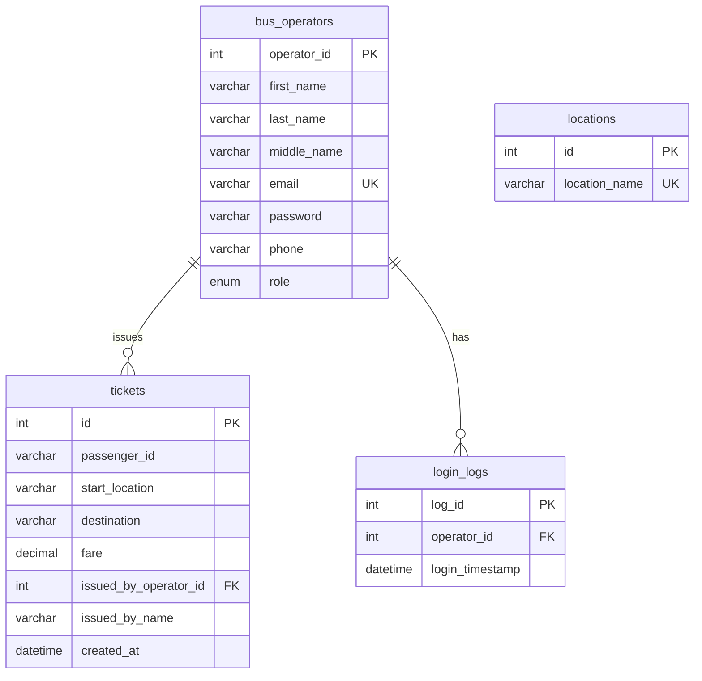

# Relational schema — bus operators, tickets, logins, locations

This document defines **SQL tables** for the ticketing and admin module (distinct from MongoDB collections used for live GPS/fleet). Use a relational engine (MySQL, MariaDB, or PostgreSQL) with **foreign keys** enforced so operator “View” screens can load related rows by `operator_id`.

---

## Entity relationships



`locations` is reference data for dropdowns; `tickets` store `start_location` / `destination` as text (see optional FK variant below).

**Note:** `tickets.start_location` and `tickets.destination` can reference `locations.location_name` or `locations.id` depending on whether you normalize to IDs only. Below, **name-based FKs** match your dropdown labels (`dulogon`, `wdadwad`) directly; alternatively use `start_location_id` / `destination_id` → `locations(id)` for stricter integrity.

---

## Table definitions (MySQL / MariaDB)

```sql
-- Roles for gatekeeping in the ticketing app
CREATE TABLE bus_operators (
  operator_id INT UNSIGNED NOT NULL AUTO_INCREMENT PRIMARY KEY,
  first_name VARCHAR(100) NOT NULL,
  last_name VARCHAR(100) NOT NULL,
  middle_name VARCHAR(100) NULL,
  email VARCHAR(255) NOT NULL,
  password VARCHAR(255) NOT NULL COMMENT 'store hash only, never plain text',
  phone VARCHAR(32) NULL,
  role ENUM('Admin', 'Operator') NOT NULL DEFAULT 'Operator',
  UNIQUE KEY uq_bus_operators_email (email)
);

CREATE TABLE locations (
  id INT UNSIGNED NOT NULL AUTO_INCREMENT PRIMARY KEY,
  location_name VARCHAR(150) NOT NULL,
  UNIQUE KEY uq_locations_name (location_name)
);

CREATE TABLE tickets (
  id INT UNSIGNED NOT NULL AUTO_INCREMENT PRIMARY KEY,
  passenger_id VARCHAR(32) NOT NULL COMMENT 'e.g. PID-302359',
  start_location VARCHAR(150) NOT NULL,
  destination VARCHAR(150) NOT NULL,
  fare DECIMAL(10, 2) NOT NULL DEFAULT 15.00,
  issued_by_operator_id INT UNSIGNED NOT NULL,
  issued_by_name VARCHAR(255) NOT NULL COMMENT 'denormalized at issue time; avoids N/A in admin UI',
  created_at DATETIME NOT NULL DEFAULT CURRENT_TIMESTAMP,
  CONSTRAINT fk_tickets_operator
    FOREIGN KEY (issued_by_operator_id) REFERENCES bus_operators (operator_id)
    ON UPDATE CASCADE
    ON DELETE RESTRICT,
  KEY idx_tickets_operator_created (issued_by_operator_id, created_at),
  KEY idx_tickets_created (created_at)
);

CREATE TABLE login_logs (
  log_id INT UNSIGNED NOT NULL AUTO_INCREMENT PRIMARY KEY,
  operator_id INT UNSIGNED NOT NULL,
  login_timestamp DATETIME NOT NULL DEFAULT CURRENT_TIMESTAMP,
  CONSTRAINT fk_login_logs_operator
    FOREIGN KEY (operator_id) REFERENCES bus_operators (operator_id)
    ON UPDATE CASCADE
    ON DELETE CASCADE,
  KEY idx_login_logs_operator_time (operator_id, login_timestamp)
);
```

### PostgreSQL notes

- Replace `AUTO_INCREMENT` with `GENERATED ALWAYS AS IDENTITY` or `SERIAL`.
- Replace `ENUM('Admin','Operator')` with `VARCHAR` + `CHECK` or a small `roles` lookup table.
- Use `TIMESTAMP WITH TIME ZONE` for `created_at` / `login_timestamp` if clients span zones.

---

## Why this structure works

| Concern | How the schema addresses it |
|--------|-----------------------------|
| **“N/A” on admin ticket list** | `issued_by_name` is written when the ticket is created (from the session), so lists stay readable even if names are edited later. `issued_by_operator_id` remains the source of truth for joins and “View operator” filters. |
| **Revenue / totals** | `fare DECIMAL(10,2)` with default `15.00` supports `SUM(fare)` for filtered passenger rows (e.g. ₱168.00). |
| **Day / month / year filters** | Index on `tickets.created_at` (and composite with `issued_by_operator_id`) supports range queries for Passenger Records. |
| **Dropdowns** | `locations.location_name` feeds “Select start location” / “Select destination”. Seed rows like `dulogon`, `wdadwad`. |
| **Operator card “View”** | FK from `tickets` and `login_logs` to `bus_operators.operator_id` allows one API to return operator profile + all tickets + all login times for that ID. |

---

## Example queries — “View” for one operator

**All tickets issued by operator `23423`:**

```sql
SELECT id, passenger_id, start_location, destination, fare,
       issued_by_name, created_at
FROM tickets
WHERE issued_by_operator_id = 23423
ORDER BY created_at DESC;
```

**All login timestamps for profile / audit:**

```sql
SELECT log_id, login_timestamp
FROM login_logs
WHERE operator_id = 23423
ORDER BY login_timestamp DESC;
```

**Totals for analytics (respecting the same filters as the UI):**

```sql
SELECT COUNT(*) AS total_records, COALESCE(SUM(fare), 0) AS total_revenue
FROM tickets
WHERE issued_by_operator_id = 23423
  AND created_at >= '2026-01-01'
  AND created_at < '2026-02-01';
```

---

## API shape (for frontends)

Suggested endpoints (implement in `services/operator-api` or `Backend/Admin_Backend`):

- `GET /operators/:operatorId` — operator row (no password hash in JSON).
- `GET /operators/:operatorId/tickets` — paginated, query params: `from`, `to`, `day`, `month`, `year` as needed.
- `GET /operators/:operatorId/login-logs` — optional pagination.
- `GET /locations` — ordered list for dropdowns.
- `POST /tickets` — body includes `issued_by_operator_id` and `issued_by_name` from session after auth.

---

## Dual database reminder

- **MongoDB Atlas**: real-time GPS, geofences, buses, firmware, etc. ([`mongodb-collections.md`](mongodb-collections.md)).
- **SQL**: ticketing, operators, locations, login audit — this document.

Keep connection strings and migrations separate per stack.
